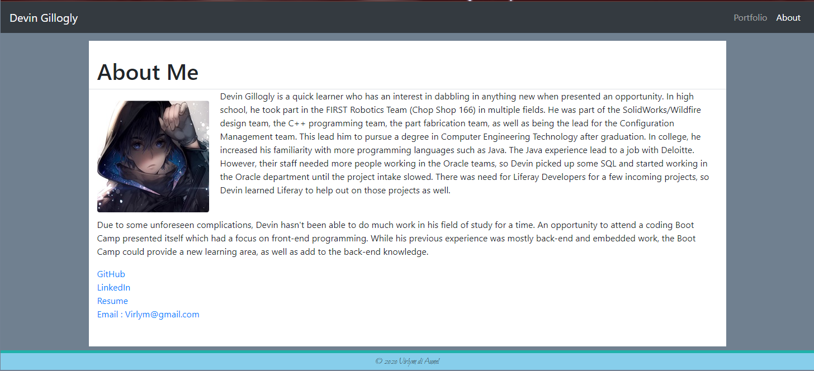
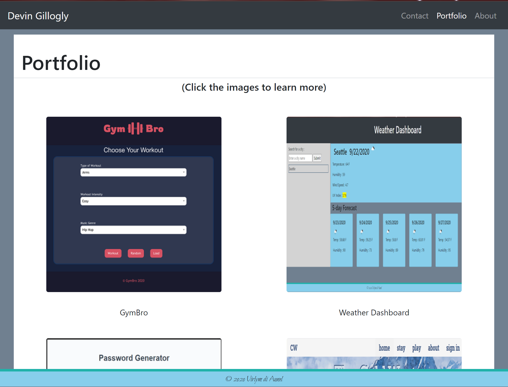

# **react-portfolio**
  
  
  
  ## **Description**
  
  Refactor the html-based profile to leverage React.js. Has an About page that gives some background information, a Portfolio page that lists a few projects with GitHub and deployed links, and a Contact page (which currently is just for looks.)
  <br><br>
  
  ## **Table of Contents**
  
  * [Installation](#Installation)
  * [Usage](#Usage)
  * [License](#License)
  * [Contributing](#Contributing)
  * [Technology](#Technology)
  * [Questions](#Questions)
  
  <br><br>
  
  ## **Installation**
  
  1. Clone the repo
  ```sh
  git clone https://github.com/virlym/react-portfolio.git
  ``` 
  2. Install NPM packages
  ```sh
  npm install
  ```
  <br><br>
  
  ## **Usage**
[Deployed link](https://djg-react-portfolio.herokuapp.com/)



  <br><br>
  
  ## **License**
  
  Distributed under the MIT License.
  <br><br>
  
  ## **Contributing**
  Contributions are what make the open source community such an amazing place to be learn, inspire, and create. Any contributions you make are **greatly appreciated**.
  
  1. Fork the Project
  2. Create your Feature Branch (`git checkout -b feature/AmazingFeature`)
  3. Commit your Changes (`git commit -m 'Add some AmazingFeature'`)
  4. Push to the Branch (`git push origin feature/AmazingFeature`)
  5. Open a Pull Request
  
  <br><br>
  
  ## **Technology**
  - [JavaScript](https://www.javascript.com/)
  - [React.js](https://reactjs.org/)
  - [npm React Helmet](https://www.npmjs.com/package/react-helmet)
  <br><br>
  
  ## **Questions**
  Learn about more of my work at [my GitHub](https://github.com/virlym)
  
  You can send any additional questions to my email : virlym@gmail.com
  <br><br><br><br>